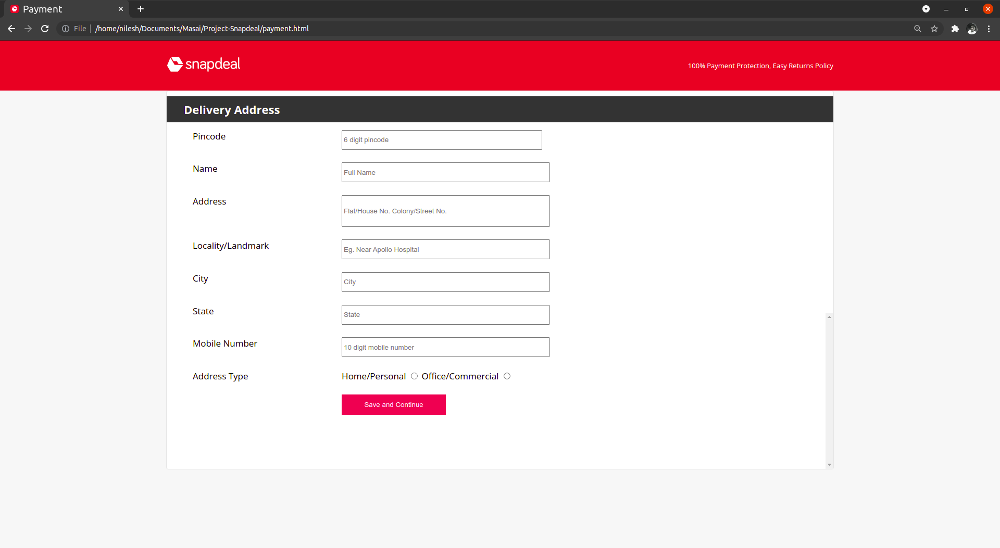

# Clone_Snapdeal
 
 This is our first project at Masai School.

 ## Project Description
 We are from the ft-web12 batch of Masai School, our task is to make a clone of the snapdeal website in 6 days.
 
 Snapdeal is an eCommerce website that is a business model that involves sales transactions being done on the web. The Company offers a variety of products such as electronics, clothing, groceries, kitchenware, and many more.

 ### [Blog post to know about our project in detail.](https://medium.com/@nilesh_fw12_098/cloning-snapdeal-com-dfd31043667)

 ## Technologies Used
 - Html
 - Css
 - Javascript

 ## Pages Included
 - Landing page.
 - Login / Signup.
 - Product details page.
 - Category page.
 - Product cart page.
 - Payment page.

## Screenshots 
- Landing Page

 

- Login/Signup

 

- Product Detail Page

- Category Page

- Product Cart

- Payment Page

